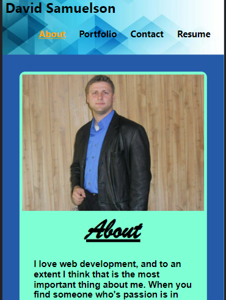
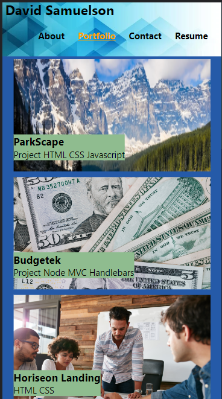
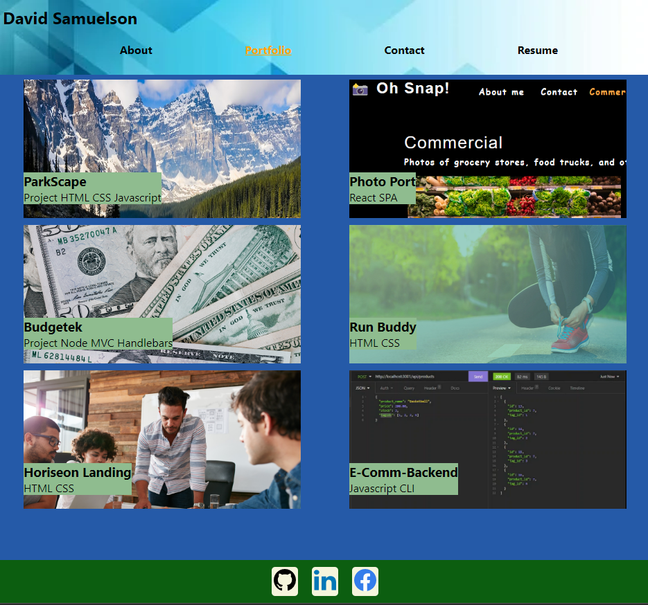
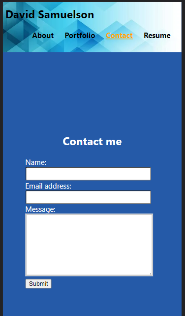
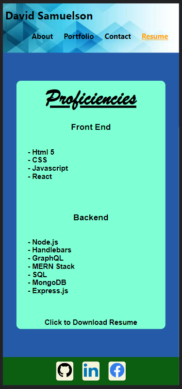

# SPA-Portfolio

## Table of Contents

- [Description](#description)
- [Contributors](#contributors)
- [Features](#features)
- [Installation](#installation)
- [Usage](#usage)
- [Contact Information](#contact)
- [License](#license)

## Deployed Website

https://dsamuelson.github.io/spa-portfolio/
## Description

This is my portfolio built using React! Of course this is not my total portfolio, but it is enough to demonstrate my knowledge of React principles and show off some of my work. It can be adjusted to meet the needs of whoever wants to use it. All styling is done in the index.css so if you don't like the simple style I went with feel free to adjust it.

 When you enter the page you are greeted with the "about me" section which has a short description of myself and how I got into web-development. I have made the page mobile-first responsive so feel free to browse from your phone.

 

 After you choose to go to another page the link you picked will go orange and underlined and the title of the tab will change to whatever the current page is.

 

 Here is a good example of how it's mobile responsive as you can see everything lines up nicely and when you go to a larger screen size it will grid up.

 

There is a non-functioning contact page (non-functioning as in it is not attached to a backend database so it won't actually contact anyone, though it could be attached to a database and made functional)

 Then finally there is a page dedicated to my resume which you can download at any time but you get a general idea of my proficiencies.

Thank you very much for using my page!

## Contributors

David Samuelson

## Features

- Uses React

- Very responsive

- mobile first design

## Installation

- it is deployed, but if you want to work on it yourself just clone the repository to a local repo

- run npm -i to install the required modules

- run npm start to start up a local server which should automatically open the page

## Usage

- usage is like any web page

## Contact

linksn.1fan@gmail.com

GitHub: https://github.com/dsamuelson?tab=repositories

## License

Link: https://choosealicense.com/licenses/unlicense/

License Terms:
This is free and unencumbered software released into the public domain.

Anyone is free to copy, modify, publish, use, compile, sell, or
distribute this software, either in source code form or as a compiled
binary, for any purpose, commercial or non-commercial, and by any
means.

In jurisdictions that recognize copyright laws, the author or authors
of this software dedicate any and all copyright interest in the
software to the public domain. We make this dedication for the benefit
of the public at large and to the detriment of our heirs and
successors. We intend this dedication to be an overt act of
relinquishment in perpetuity of all present and future rights to this
software under copyright law.

THE SOFTWARE IS PROVIDED "AS IS", WITHOUT WARRANTY OF ANY KIND,
EXPRESS OR IMPLIED, INCLUDING BUT NOT LIMITED TO THE WARRANTIES OF
MERCHANTABILITY, FITNESS FOR A PARTICULAR PURPOSE AND NONINFRINGEMENT.
IN NO EVENT SHALL THE AUTHORS BE LIABLE FOR ANY CLAIM, DAMAGES OR
OTHER LIABILITY, WHETHER IN AN ACTION OF CONTRACT, TORT OR OTHERWISE,
ARISING FROM, OUT OF OR IN CONNECTION WITH THE SOFTWARE OR THE USE OR
OTHER DEALINGS IN THE SOFTWARE.

For more information, please refer to <https://unlicense.org>
    
